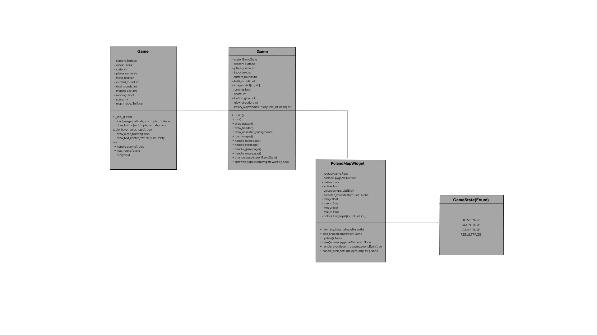

# Projekt_programowanie
Gra polegająca na przyporządkowaniu miejsca ze zdjęcia do odpowiedniego województwa.

**Biblioteki wykorzystane w projekcie**  

1) Biblioteki wbudowane  
-sys  
-os  
-random  
-enum  
2) Biblioteki zewnętrzne  
-pygame  
-pyshp (biblioteka do obsługi plików Shapefile)  
-shapely  
3) Moduły lokalne  
-game_state  
-map  
-Game  

**Uruchomienie programu i jego obsługa** 

1) Pobieranie:
-Pobierz repozytorium (https://github.com/kkondzio/Projekt_programowanie/archive/refs/heads/main.zip)  
-Rozpakuj plik  
-Stwórz środowisko - otwórz CMD (wiersz poleceń)  
-Przejdź do katalogu "\Projekt_programowanie-main"  
-"pip install virtualenv"  
-"python -m venv venv"  

2)Uruchom środowisko wirtualne:  
-UNIX - "source venv/scripts/activate"  
-WINDOWS - "venv\Scripts\activate.bat"  
-Zainstaluj biblioteki (cofnij się do \Projekt_programowanie-main:  
"pip install -r requirements.txt")  

3)Uruchomienie:  
-python src/main.py  

Interfejs użytkownika: 
Po uruchomieniu pojawi się główne okno z trzema przyciskami: 

Start Gry – rozpoczyna rozgrywkę. 
Zakończ – zamyka okno aplikacji. 
Mapka z podziałem na województwa – wyświetla mapę Polski z podziałem na województwa (używana do zaznaczania wybranego regionu). 

**Instrukcja użytkowania**  

Po uruchomieniu main.py na ekranie pojawi się okno z grą. Aby rozpocząć grę użytkownik musi nacisnąć pole „Start Gry”. Następnie na pulpicie wyświetlona zostaje mapa z podziałem na województwa i zdjęcie miasta z Polski.  Zadaniem gracza jest odpowiednie dopasowanie wyświetlonego zdjęcia do konkretnego województwa (za każdą poprawną odpowiedź użytkownik otrzymuje jeden punkt).  Gra kończy się po trzech rundach, po czym na ekranie zostaje wyświetlony wynik poprawnie zaznaczonych odpowiedzi (np.2/3). Po chwili użytkownik zostaje przeniesiony do ekranu początkowego, gdzie ponownie może rozpocząć grę lub wyjść z niej przyciskiem ”zakończ”. 

